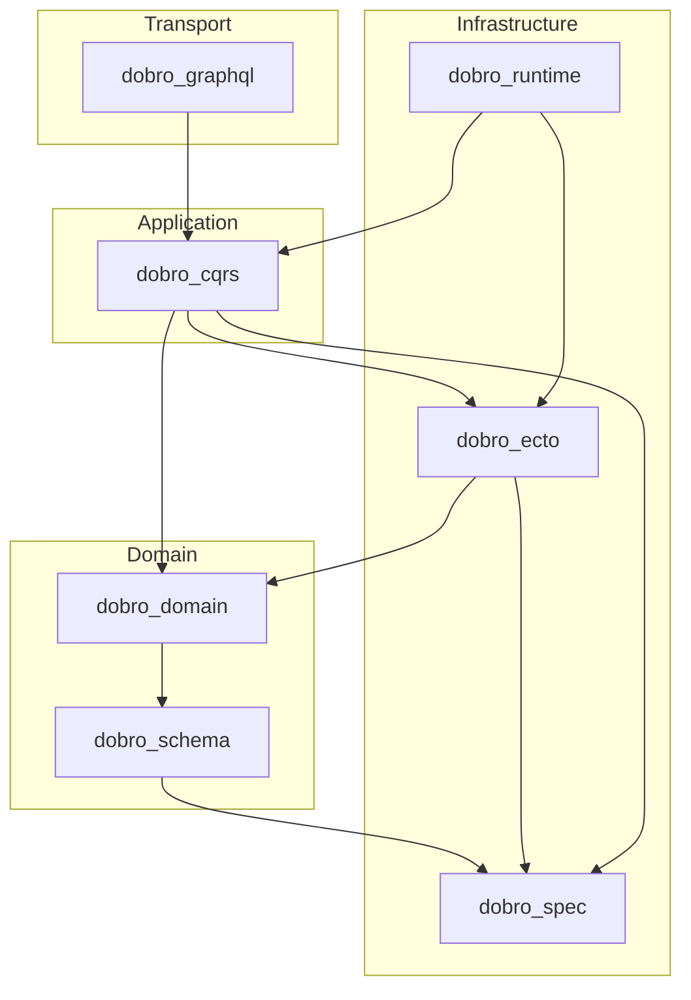

# Dobro

Dobro is a modular Elixir framework for building domain-driven, CQRS-oriented applications with hexagonal architecture. It is published as a family of focused Hex packages so you can adopt only what your project needs — from validation and ports alone, through to full command/query APIs with GraphQL.

## Design principles

**Event-centric domain model.** Aggregate state always changes through domain events. Command functions build events, apply them to in-memory state, and validate invariants before anything is persisted. This programming model is the same whether you store aggregate snapshots, append to an event stream, or both — similar in spirit to [Axon Framework](https://axoniq.io/product-overview/axon-framework): events drive state transitions; the storage strategy is a separate, swappable concern.

**Hexagonal boundaries.** Domain and application code depend on ports (interfaces). Infrastructure implements adapters and registers them at compile time. Tests swap in Mox doubles without changing business logic.

**CQRS separation.** Commands mutate state through aggregates and write repositories. Queries read through dedicated read repositories and never touch the write model directly. Application queries (in `dobro_cqrs`) define use-case inputs; infrastructure queries (`defquery` in `dobro_ecto`) define how those reads are executed in SQL.

**Progressive adoption.** Each package stands alone. Add persistence, handlers, runtime actors, or GraphQL only when you need them.

## Architecture



## Packages

| Package | Purpose |
|---------|---------|
| [dobro](dobro/) | Meta package — Igniter installer + generators |
| [dobro_spec](dobro_spec/) | Ports, adapters, adapter registries, and shared configuration |
| [dobro_schema](dobro_schema/) | Typed schemas, validation pipelines, and input contracts |
| [dobro_domain](dobro_domain/) | Aggregates, value objects, domain events, specifications, and execution context |
| [dobro_ecto](dobro_ecto/) | Ecto read/write repositories, the `defquery` DSL, and projections |
| [dobro_cqrs](dobro_cqrs/) | Commands, queries, handlers, scope policy, and public API definitions |
| [dobro_runtime](dobro_runtime/) | OTP runtime for aggregate actors, event delivery, and concurrent command execution |
| [dobro_graphql](dobro_graphql/) | Absinthe schema generation from Dobro API modules (optional) |
| [dobro_ai](dobro_ai/) | AI sessions and tool calling (optional) |

## Installer

```bash
mix igniter.new my_app --install dobro
mix dobro.gen.bc MyApp.Catalog.Products
mix dobro.gen.aggregate MyApp.Catalog.Products.Product --fields name:string
```

See the [root README](../README.md) for Igniter, git/path deps, and Hex publishing notes.

## Dependency order

```
dobro_spec
  └── dobro_schema
        └── dobro_domain
              └── dobro_ecto
                    └── dobro_cqrs
                          └── dobro_runtime (optional; depends on cqrs)
                                └── dobro_graphql
```

`dobro_cqrs` does **not** depend on `dobro_runtime`. Runtime is an optional add-on configured at the application level.

## Choosing packages

| Goal | Packages |
|------|----------|
| Ports and adapters only | `dobro_spec` |
| Validation and DTOs without a database | `dobro_spec` + `dobro_schema` |
| Domain modelling (aggregates, events, VOs) | + `dobro_domain` |
| Ecto read models and list queries | + `dobro_ecto` |
| Command and query handlers (synchronous) | + `dobro_cqrs` |
| Identified aggregates, PubSub delivery, event handlers | + `dobro_runtime` |
| GraphQL API surface | + `dobro_graphql` |

## Persistence model

Dobro treats **how state transitions are expressed** and **how they are stored** as separate concerns.

### State transitions (always event-based)

Every aggregate mutation follows the same pipeline:

1. A command handler invokes an aggregate function with a typed contract.
2. The aggregate function uses `add_event/3` to record domain events against current state.
3. `apply_changes/1` applies each event to the aggregate (via `defapply/2`) and checks invariants.
4. The resulting aggregate and events are handed to the configured persistence layer.

This is true for create, update, and delete flows. Deletes emit `*Deleted` events; the persistence layer resolves the appropriate storage operation.

### Storage strategies (pluggable)

| Strategy | Description | Status |
|----------|-------------|--------|
| **Stateful persistence** | Aggregate state is stored in relational tables via write repositories. Domain events are persisted alongside state and published to subscribers. Optimistic concurrency is enforced through a `version` field (`:concurrent_modification` on conflict). | Available |
| **Event-sourced persistence** | Aggregate state is derived from an append-only event stream. Commands append events (using event `version` as `event_number`); state is rebuilt by replay. Unique stream/version conflicts map to `:concurrent_modification`. | Available |

Both strategies use the same domain model, command handlers, and event definitions. Persistence strategies determine which storage applies to each aggregate. You can mix strategies across bounded contexts in the same application.

### Event delivery

After a successful write, domain events can be:

- **Persisted only** — `event_delivery_strategy: :none` writes state and events without broadcasting.
- **Published to PubSub** — `event_delivery_strategy: :pubsub` broadcasts enriched events on a stream named after the aggregate (`AggregateModule.__stream_name__/0`), where event handlers and projectors subscribe.
- **Staged via outbox** — `event_delivery_strategy: :outbox` inserts outbox rows in the same transaction; `Dobro.Runtime.OutboxRelay` publishes to PubSub asynchronously.

Both storage strategies integrate with the same handler and projection interfaces.

## End-to-end walkthrough

The following sketch shows how the packages fit together for a typical bounded context. See each package README for full detail.

### 1. Define a port and registry (`dobro_spec`)

```elixir
defmodule MyApp.Ports.UserReadRepo do
  use Dobro.Infra.Data.ReadRepo.PortDefinition
end

defmodule MyApp.AdapterRegistry do
  use Dobro.Spec.AdapterRegistry

  register MyApp.Users.Infra.UserReadRepo
  register MyApp.Users.Infra.UserWriteRepo
end
```

### 2. Model the domain (`dobro_domain` + `dobro_schema`)

```elixir
defmodule MyApp.Users.Domain.User do
  use Dobro.Domain.Aggregate

  alias MyApp.Users.Domain.Events

  state do
    field :id, :id, immutable: true
    field :email, :string, required: true
    field :name, :string, required: true
  end

  defcontract Register do
    field :email, :string, required: true
    field :name, :string, required: true
  end

  def register(%Register{} = input) do
    pipeline(input)
    |> add_event(Events.UserRegistered)
    |> apply_changes()
  end

  defapply Events.UserRegistered
end
```

### 3. Wire persistence (`dobro_ecto`)

**Write repo** — persists aggregates:

```elixir
defmodule MyApp.Users.Infra.UserWriteRepo do
  use Dobro.Infra.Data.WriteRepo,
    aggregate: MyApp.Users.Domain.User,
    schema: MyApp.Users.Infra.UserSchema,
    mapper: MyApp.Users.Infra.UserMapper,
    tenant_strategy: :tenant_id
end
```

**Read repo** — infrastructure queries (`defquery`) backing application queries:

```elixir
defmodule MyApp.Users.Infra.UserReadRepo do
  use Dobro.Infra.Data.ReadRepo,
    port: MyApp.Ports.UserReadRepo,
    schema: MyApp.Users.Infra.UserSchema,
    scopes: [:tenant]

  defquery ListUsers, type: :list do
    filterable [:email, :name]
    sortable [:email, :name]
    query fn _args, _context -> from u in schema(), as: :user end
  end

  defquery GetUser, type: :one
end
```

### 4. Define commands and handlers (`dobro_cqrs`)

```elixir
defmodule MyApp.Users.App.UserCommands do
  use Dobro.App.CommandDefinition
  alias MyApp.Users.Domain.User

  command RegisterUser do
    scope :tenant, from: :context

    payload do
      field :email, :string, required: true
      field :name, :string, required: true
    end
  end

  command_handler Handler, aggregate: User do
    handle RegisterUser, :register, contract: User.Register
  end
end
```

### 5. Define application queries and handlers (`dobro_cqrs`)

Application queries define use-case inputs. They delegate to infrastructure repo functions — **not** `defquery`:

```elixir
defmodule MyApp.Users.App.UserQueries do
  use Dobro.App.QueryDefinition
  alias Dobro.App.Types.Query
  alias MyApp.Ports.UserReadRepo

  query GetUser do
    scope :tenant, from: :context
    payload do
      field :id, :id, required: true
    end
  end

  query ListUsers do
    scope :tenant, from: :context
    payload do
      field :query, Query
    end
  end

  query_handler Handler, repo: UserReadRepo do
    handle GetUser, :get_user              # matches repo function (default from query module)
    handle ListUsers, :list_users
  end
end
```

### 6. Expose a public API (`dobro_cqrs`)

```elixir
defmodule MyApp.Users.UsersApi do
  use Dobro.App.Api,
    port: MyApp.Ports.UsersApi,
    context: {MyApp.Users, :users}

  alias MyApp.Users.App.{UserCommands, UserQueries}

  route :get_user,
    query: UserQueries.GetUser,
    to: UserQueries.Handler,
    policy: :users_read,
    result: User

  route :register_user,
    command: UserCommands.RegisterUser,
    to: UserCommands.Handler,
    policy: :users_manage
end
```

### 7. Add runtime for identified aggregates (`dobro_runtime`, optional)

When commands carry an `identity` block (updates to existing records), configure `execution_strategy: :actor_when_identified` so concurrent writes to the same aggregate are serialized through a GenServer actor.

### 8. Generate GraphQL (`dobro_graphql`, optional)

```elixir
defmodule MyAppWeb.Schema do
  use Absinthe.Schema

  defmodule ApiSchema do
    use Dobro.Graphql.Schema
    api MyApp.Users.UsersApi
  end

  import_types(ApiSchema)
end
```

## Configuration reference

```elixir
# Required for all Dobro applications using ports
config :dobro_spec,
  otp_app: :my_app,
  adapter_registry: MyApp.AdapterRegistry

# Required when using dobro_ecto
config :dobro_ecto,
  repo: MyApp.Repo,
  tenant_resolver: MyApp.TenantResolver   # required for :schema tenant strategy

# Required when using dobro_runtime
config :dobro_runtime,
  pubsub: MyApp.PubSub,
  outbox_relay: [enabled: false, batch_size: 100, poll_interval_ms: 1_000]

# Wire runtime into CQRS (required when using aggregate actors)
config :dobro_cqrs,
  execution_strategy: :actor_when_identified,
  persistence_strategy: :stateful,
  event_delivery_strategy: :pubsub
```

Without `dobro_runtime`, `dobro_cqrs` defaults to synchronous in-process execution. Commands that declare an `identity` return a `:runtime_required` error until runtime is configured.

### Runtime supervision

```elixir
children = [
  {Registry, keys: :unique, name: Dobro.Runtime.Registry},
  {Dobro.Runtime.AggregateSupervisor, name: Dobro.Runtime.AggregateSupervisor},
  {Dobro.Runtime.EventHandlerSupervisor, name: Dobro.Runtime.EventHandlerSupervisor}
  # Optional when event_delivery_strategy: :outbox
  # {Dobro.Runtime.OutboxRelay, name: Dobro.Runtime.OutboxRelay}
]
```

## Installation (full stack)

Until Hex publish, use path or git deps from this monorepo (see root README).

```elixir
def deps do
  [
    {:dobro, path: "../dobro/packages/dobro"},
    # optional:
    # {:dobro_graphql, path: "../dobro/packages/dobro_graphql"},
    # {:dobro_ai, path: "../dobro/packages/dobro_ai"},
    {:igniter, "~> 0.6", only: [:dev, :test]}
  ]
end
```

After Hex:

```elixir
def deps do
  [
    {:dobro, "~> 0.1"},
    {:dobro_graphql, "~> 0.1"}, # optional
    {:igniter, "~> 0.6", only: [:dev, :test]}
  ]
end
```

## Testing

Run unit tests for all Dobro packages:

```bash
mix dobro.test
```

Run package tests together with the host application suite:

```bash
mix test.all
```

## Documentation

Generate HexDocs for every package:

```bash
mix dobro.docs
```

Open generated HTML locally:

```bash
open packages/dobro_schema/doc/index.html
```

## Publishing to Hex

Each directory under `packages/` is an independent Mix project. Publish in dependency order:

1. `dobro_spec`
2. `dobro_schema`
3. `dobro_domain`
4. `dobro_ecto`
5. `dobro_cqrs`
6. `dobro_runtime`
7. `dobro` (meta + installer)
8. `dobro_graphql`
9. `dobro_ai`

Before publishing, replace path/git fallbacks in each `mix.exs` with version constraints (for example `{:dobro_schema, "~> 0.1.0"}`).

## License

MIT
